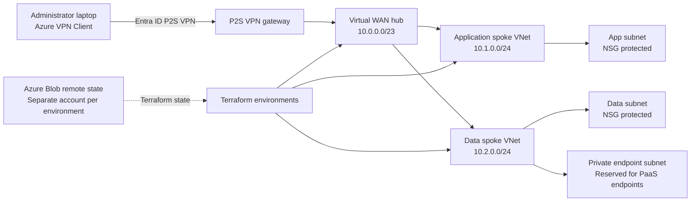

# ☁️ Enterprise Azure Hybrid Cloud Platform

**Production-Style Azure Networking & Infrastructure Automation with Terraform**


An enterprise-style Azure hybrid cloud platform demonstrating secure networking, infrastructure-as-code, identity-driven access, environment isolation, remote state management, CI/CD automation, security scanning, drift detection, and operational troubleshooting.

## Contents

- [Architecture Diagram](#architecture-diagram)
- [Overview](#overview)
- [What I Built](#what-i-built)
- [Repository Structure](#repository-structure)
- [Getting Started](#getting-started)
- [Remote State](#remote-state)
- [Validation](#validation)
- [CI/CD](#cicd)
- [What I Learned](#what-i-learned)
- [Change Record](#change-record)
- [Future Enhancements](#future-enhancements)
- [Project Status](#project-status)

# 🏗️ Architecture

The following Mermaid diagram represents the **currently implemented Azure topology**.



## Overview

This project demonstrates a reusable Azure infrastructure platform built with Terraform, PowerShell, Microsoft Entra ID, and GitHub Actions.

The platform focuses on infrastructure and operational patterns commonly required in enterprise Azure environments:

- Azure Virtual WAN and Virtual Hub for centralized connectivity
- Application and data spoke workload subnets with NSG protection
- Entra ID-authenticated P2S VPN for administrator access
- Dedicated subnet reserved for future private endpoints
- Separate dev, test, and prod environments with isolated Terraform state
- Azure Blob Storage remote state
- Azure RBAC and Blob data-plane access control
- User-assigned managed identity
- Monitoring and network diagnostics
- Backup infrastructure
- GitHub Actions validation and deployment workflows
- OIDC-based keyless Azure authentication
- Terraform validation and linting
- Checkov and Trivy security scanning
- Scheduled infrastructure drift detection
- Operational troubleshooting and rollback documentation

The project is designed to demonstrate the complete infrastructure lifecycle:

**Design → Automate → Secure → Validate → Deploy → Monitor → Troubleshoot**

The network, VPN control plane, environment isolation, Terraform validation, and plan workflows have been tested. A packet-level workload test remains pending an Azure-side target because the current subscription does not have a suitable VM SKU or quota available in East US.

## What I Built

### Cloud Infrastructure

- Azure Virtual WAN and Virtual Hub
- Application and data spoke VNets
- NSG-protected subnets
- P2S VPN connectivity
- Private endpoint networking foundation
- Log Analytics monitoring
- Recovery Services backup foundation

### Identity and Security

- Microsoft Entra ID and Azure RBAC
- User-assigned managed identity
- Entra ID-authenticated P2S VPN
- GitHub Actions OIDC with federated workload identity
- Checkov (advisory), Trivy, and TFLint

### Infrastructure as Code

- Reusable Terraform modules
- Environment-specific root configurations
- Azure Blob Storage remote state with separate state boundaries for dev, test, and prod
- Automated validation
- Saved Terraform plan artifacts
- Scheduled drift detection

### Automation and Operations

- PowerShell backend bootstrap script
- Azure CLI authentication
- GitHub Actions CI/CD
- Controlled Terraform apply and destroy
- Rollback and troubleshooting documentation

## Repository Structure

```text
Azure-Hybrid-Cloud-PS-Project/
├── .github/
│   └── workflows/
│       ├── terraform-quality.yml
│       ├── terraform-plan.yml
│       ├── terraform-apply.yml
│       ├── terraform-destroy-plan.yml
│       └── terraform-destroy-apply.yml
├── demo/                         # Local-state validation entry point
├── docs/
│   ├── images/                   # Architecture diagram and validation screenshots
│   ├── troubleshooting.md
│   ├── rollback-runbook.md
│   └── validation/
│       └── test.md
├── environments/
│   ├── dev/                      # Development root module and backend
│   ├── test/                     # Test root module and backend
│   └── prod/                     # Production root module and backend
├── modules/
│   ├── backup/                   # Recovery Services vault and VM policy
│   ├── governance/               # Audit-only environment tag policy
│   ├── identity/                 # User-assigned managed identity
│   ├── monitoring/               # Log Analytics workspace and network diagnostics
│   └── network/                  # Virtual WAN, hub, spokes, VPN, and NSGs
├── scripts/
│   └── Bootstrap-Backend.ps1     # Creates Azure Terraform state storage
├── .gitignore
└── README.md
```

## Getting Started

Choose the path that matches what you want to do:

| Path | Purpose | Terraform state | Best for |
|---|---|---|---|
| Demo | Inspect and validate Terraform | Local | Recruiters and reviewers |
| Azure environments | Plan or deploy the full platform | Azure Blob Storage | Engineers and real deployments |

### Version Requirements

Terraform and provider version constraints are declared throughout the root configurations and reusable modules.

| Component | Constraint | Applies to |
|---|---|---|
| Terraform CLI | `>= 1.7.0` | All root configurations and modules |
| AzureRM provider | `~> 5.4.0` | Demo, Azure environments, and modules |
| AzureAD provider | `~> 2.53` | Dev, test, and prod environments |

The demo and each Azure environment include a committed `.terraform.lock.hcl` file recording the selected provider versions and checksums. `terraform init` uses those locked selections. Run `terraform init -upgrade` only when intentionally updating providers, and commit the resulting lockfile changes.

### Option 1: Quick Demo

The demo is the fastest way to review the Terraform without configuring Azure remote state.

**Prerequisites:** Terraform CLI 1.7 or later, Git, and PowerShell 7+ (`pwsh`).

Verify the tools:

```bash
terraform version
git --version
pwsh --version
```

Clone the repository and validate:

```bash
git clone https://github.com/CloudTechs-ai/Azure-Hybrid-Cloud-PS-Project.git
cd Azure-Hybrid-Cloud-PS-Project/demo
terraform init
terraform validate
```

To generate a plan, configure Azure CLI authentication and an Azure subscription first. The demo uses local Terraform state and does not require Azure Blob Storage authentication or remote-state RBAC, but the Azure provider still contacts Azure during planning:

```bash
az login
terraform plan
```

> **Do not run `terraform apply` or `terraform destroy` against another person's subscription.**

### Option 2: Deploy an Azure Environment

**Prerequisites:** an Azure subscription, Azure CLI, Terraform CLI 1.7 or later, PowerShell 7+, and permission to create the platform resources. Backend bootstrap additionally requires the Azure PowerShell `Az` module.

Verify the tools:

```powershell
az version
terraform version
pwsh --version
```

Install Azure PowerShell if required:

```powershell
Install-Module -Name Az -Scope CurrentUser -Repository PSGallery -Force
```

Authenticate to Azure. Terraform uses Azure CLI authentication for the configured Blob backend, and the bootstrap script uses the separate Azure PowerShell sign-in context:

```powershell
az login
az account show
Connect-AzAccount
```

If you have multiple subscriptions, select the intended one in both contexts:

```powershell
az account set --subscription "<SUBSCRIPTION_ID>"
Set-AzContext -Subscription "<SUBSCRIPTION_ID>"
```

## Remote State

### Bootstrap

Prepare remote state before initializing Terraform. Each environment uses a separate Azure Storage account, resource group, container, and state key.

The bootstrap script creates a resource group, storage account, and `tfstate` container. It does not grant Blob data permissions or edit Terraform backend files. Run it from the repository root for each backend that needs to be created:

```powershell
.\scripts\Bootstrap-Backend.ps1 -Suffix dev01ahcps -Environment dev
.\scripts\Bootstrap-Backend.ps1 -Suffix test01ahcps -Environment test
.\scripts\Bootstrap-Backend.ps1 -Suffix prod03ahcps -Environment prod
```

These suffixes match the backend names documented below. The script is safe to rerun for existing resources. If you use different names, update the corresponding `backend.tf` values to match before running `terraform init`.

The identity running Terraform also needs the **Storage Blob Data Contributor** role on the state storage account or container. Bootstrap does not assign this role, so arrange the assignment separately and allow time for it to take effect.

### Deploy Development

```powershell
Set-Location .\environments\dev
Copy-Item terraform.tfvars.example terraform.tfvars
terraform init -reconfigure
terraform validate
terraform plan
```

Review the plan carefully before applying:

```powershell
terraform apply
```

Never run an apply from the wrong environment directory, and never commit `terraform.tfvars`, state files, credentials, or storage keys.

### Test Environment

Test maintains its own Terraform configuration and remote state, independent from development:

```powershell
cd ..\test
terraform init
terraform validate
terraform plan
```

### Production Environment

Production is intentionally separated from dev and test. Use the repository's GitHub Actions workflow for controlled production deployment rather than treating prod as an unrestricted local deployment.

The current repository does not have GitHub-enforced environment reviewer approvals enabled. See [CI/CD](#cicd) for the existing safeguards and limitations.

### Environment and State Design

Each environment uses a separate Azure Storage account, resource group, container, and state key. This prevents state overlap and creates an independent recovery boundary.

| Environment | Backend resource group | Storage account | Container | State key |
|---|---|---|---|---|
| dev | `rg-tfstate-dev01ahcps` | `sttfstatedev01ahcps` | `tfstate` | `dev.terraform.tfstate` |
| test | `rg-tfstate-test01ahcps` | `sttfstatetest01ahcps` | `tfstate` | `test.terraform.tfstate` |
| prod | `rg-tfstate-prod03ahcps` | `sttfstateprod03ahcps` | `tfstate` | `prod.terraform.tfstate` |

The `ahcps` suffix makes the storage account names globally unique while preserving the environment identifiers `dev01`, `test01`, and `prod03`. Separate storage accounts were chosen because they provide a clearer security and recovery boundary than sharing one account across all environments.

### Backend Protection

The backend bootstrap script configures:

- StorageV2 account
- Standard LRS redundancy
- HTTPS and TLS 1.2
- Blob public access disabled
- Dedicated `tfstate` container

For production use, enable and verify Blob versioning, blob soft delete, container soft delete, and change feed on each state storage account.

### Remote State Troubleshooting

One of the key operational lessons from this project: **authentication is not authorization, and Azure management-plane access is not the same as Blob data-plane access.** Successfully authenticating to Azure does not automatically grant Terraform permission to access Blob data.

| Error | Meaning | Typical cause |
|---|---|---|
| `401 Unauthorized` | Authentication failed | Missing or invalid authentication |
| `403 AuthorizationPermissionMismatch` | Identity authenticated but lacks data access | Missing Blob data role, or role assignment not yet effective |
| `404 Resource Not Found` | Backend resource could not be found | Wrong subscription, resource group, storage account, container, or state key |

Before troubleshooting Terraform itself, verify the active subscription, resource group, storage account, container, state key, authentication method, and Blob data permissions.

Local development commonly uses Azure CLI authentication. GitHub Actions uses GitHub OIDC through Microsoft Entra ID. These are separate authentication workflows.

## Validation

### Terraform

The repository uses multiple layers of Terraform validation:

```bash
terraform fmt -check -recursive
terraform init -input=false -reconfigure
terraform validate
terraform plan -input=false -lock-timeout=5m
```

The demo, dev, test, and prod configurations were initialized with `terraform init -backend=false -upgrade` and passed `terraform validate` using AzureRM 5.4.0.

A colleague is independently testing the updated configuration against their own Terraform state. Those results are pending and are not represented here as completed.

### P2S Control-Plane Validation

The test environment P2S control plane was validated with Azure VPN Client:

- Entra ID authentication succeeded
- The VPN gateway was reachable and attached
- The laptop received VPN address `172.16.0.130`
- Routes for the hub, app spoke, data spoke, and VPN pool were received
- Azure VPN Client reached **Connected**
- Azure Portal reported the active P2S session when refreshed promptly

See [`docs/validation/test.md`](docs/validation/test.md) for the recorded evidence and procedure.

### End-to-End Traffic Validation

End-to-end packet flow requires an Azure-side private target, such as a VM or private endpoint. A temporary VM deployment was attempted, but East US capacity, SKU availability, and quota restrictions prevented deployment. The temporary VM attempt was removed.

| Validation area | Status |
|---|---|
| Terraform configuration | ✅ Validated |
| Azure networking | ✅ Validated |
| P2S control plane | ✅ Validated |
| Entra ID VPN authentication | ✅ Validated |
| VPN route validation | ✅ Validated |
| Private workload packet test | ⏳ Pending |

The project intentionally distinguishes control-plane validation from end-to-end workload validation.

### Validation Evidence

**Deployed resources.** Resource group for the `<environment>` environment, including the Virtual WAN and hub, VPN gateway, network security groups, Recovery Services vault, Log Analytics workspace, and user-assigned managed identity, all provisioned by Terraform.


**VPN connectivity.** Azure VPN Client connected to the `test` environment using Microsoft Entra ID authentication, with routes received for the hub, application spoke, data spoke, and VPN pool. This validates the P2S control plane; packet-level workload testing is pending an Azure-side target.


**CI quality checks.** Terraform Quality workflow passing on `main`: formatting, backend-free validation, TFLint, Checkov (advisory), and Trivy.


## CI/CD

Pull requests and pushes to `main` run:

- Terraform formatting
- Backend-free validation for demo, dev, test, and prod
- TFLint
- Checkov (advisory)
- Trivy

Cloud-backed plans remain manual so pull request code does not run with Azure credentials. Optional SonarCloud analysis runs when the repository variables `SONAR_ORGANIZATION` and `SONAR_PROJECT_KEY` and the secret `SONAR_TOKEN` are configured.

### GitHub OIDC

GitHub Actions authenticates to Azure through OpenID Connect and workload identity federation, with Entra federation configured for the GitHub environments each workflow uses.

```text
GitHub Actions → OIDC token → Microsoft Entra ID → Federated identity → Azure RBAC → Azure resources
```

This provides keyless authentication for the GitHub Actions Azure access path. State access is granted separately through Storage Blob Data Contributor.

### Plan and Apply Workflow

The project separates Terraform planning from application. The workflows provide:

- Manual environment selection for dev, test, and prod
- OIDC authentication
- Saved binary plan artifacts with seven-day retention
- Plan text written to the GitHub Actions job summary
- Apply that checks out and verifies the exact source commit recorded with the plan
- Shared per-environment concurrency groups, so plans, applies, drift checks, and destroys cannot operate on the same state concurrently
- Manual apply confirmation through a required `APPLY` or `CANCEL` input

The apply workflow downloads and applies the exact saved plan artifact. It never generates a new plan during apply, and should be run only with the environment, plan run ID, and source commit that were reviewed.

### Production Deployment Controls

Production apply and destroy additionally:

- Require a successful Terraform Quality run for the exact source commit
- Require the workflow definition from `main`
- Verify the matching successful plan workflow run and artifact before execution

### Destructive Operations

Destroy is separated from normal deployment and is never triggered by a push or pull request. It requires:

- A successful manual destroy plan
- Review of the saved destroy artifact
- The matching plan run ID and source commit
- Explicit typed `DESTROY` confirmation in the destroy-apply workflow

### Drift Detection

Scheduled daily workflows check dev, test, and prod. When live infrastructure differs from the Terraform configuration, the workflow opens or updates a GitHub issue, and closes it automatically once the environment is reconciled.

Failed Terraform Apply or Destroy Apply runs also open a GitHub issue linking to the failed run.

### Security Scanning

- **TFLint:** Terraform linting and configuration quality
- **Checkov:** infrastructure-as-code security analysis (advisory)
- **Trivy:** scans the Terraform repository directly

Cosign is not included because this repository does not build or publish a container image. It should be added alongside a container build workflow so it can sign and verify an actual image digest.

### Production Approval Limitation

The repository should not be presented as having independently approval-gated production deployment.

Main branch protection is not enabled because GitHub offers branch protection rules on private repositories only with a Pro, Team, or Enterprise plan, and this repository is on the Free plan. GitHub Environment required reviewers require an Enterprise plan for private repositories. This was confirmed by attempting to configure branch protection through the GitHub API, which returned `403 Upgrade to GitHub Pro or make this repository public to enable this feature`.

The existing workflow provides plan review, artifact verification, commit verification, manual confirmation, and controlled execution. Formal reviewer approval remains pending a paid GitHub plan or a repository visibility or configuration change.

See [`docs/rollback-runbook.md`](docs/rollback-runbook.md) for the incident response and rollback procedure covering failed applies, failed destroys, and detected drift.

## Monitoring and Backup

**Monitoring:** Log Analytics workspace and network diagnostics.

**Backup:** Recovery Services vault and VM backup policy. This provides the infrastructure foundation for protected workloads once a supported VM workload exists.

## What I Learned

**Management plane vs data plane.** Azure management access does not automatically provide Blob data access. Terraform remote state requires data-plane permissions.

**Authentication vs authorization.** A successful Azure login confirms who you are, not that you are allowed to perform every operation Terraform needs.

**Environment isolation.** Separate state and backend resources give clearer lifecycle and recovery boundaries between dev, test, and prod.

**CI/CD security.** GitHub OIDC authenticates to Azure without storing long-lived Azure credentials in GitHub.

**Validation layers.** Formatting, linting, security scanning, cloud-backed planning, and workload testing each validate a different layer of the platform.

**Troubleshooting.** Cloud failures often come from the underlying Azure service, identity configuration, permissions, quotas, or regional availability, not only from Terraform configuration.

## Change Record

### 2026-09-27

| Area | Change | Reason |
|---|---|---|
| README and onboarding | Added project overview, security and tool badges, and separate demo and Azure deployment instructions | Distinguish local validation from a deployment that needs Azure access, remote state, and Blob data permissions |
| Terraform versions | Changed the AzureRM constraint from `~> 3.100` to `~> 5.4.0` in all root configurations and modules; refreshed the four committed provider lockfiles to select 5.4.0 | The old constraint allowed only AzureRM 3.x and excluded the intended 5.4 release |
| Diagnostic settings | Updated the metric block to `enabled_metric` | AzureRM 5.4 expects the `enabled_metric` block in its schema |
| Recovery Services vault | Removed the unsupported `soft_delete_enabled` argument | The AzureRM 5.4 vault resource no longer accepts it |
| Version documentation | Documented Terraform and provider constraints and the purpose of committed lockfiles | Make supported version ranges and repeatable provider selections clear |

## Future Enhancements

- Add a supported private workload target for packet-level VPN validation
- Add private endpoint resources and private DNS integration
- Restrict backend network access after all required identities are known
- Add alert rules to the monitoring module
- Add VM backup association when a protected VM exists
- Add Cloud Adoption Framework and Well-Architected Framework mapping
- Enable GitHub-enforced branch and environment approval gates for production apply when the repository configuration supports them

## Troubleshooting

- [`docs/troubleshooting.md`](docs/troubleshooting.md): Azure VPN Client diagnostics, P2S session checks, Terraform backend errors, quota failures, SKU availability, and the future end-to-end traffic test procedure
- [`docs/rollback-runbook.md`](docs/rollback-runbook.md): failed applies, failed destroys, drift, and rollback procedures
- [`docs/validation/test.md`](docs/validation/test.md): P2S and route validation evidence

## Project Status

| Capability | Status |
|---|---|
| Azure Virtual WAN and Virtual Hub | ✅ Implemented |
| Application and data spokes | ✅ Implemented |
| NSGs | ✅ Implemented |
| Entra ID P2S VPN | ✅ Implemented |
| Managed identity and Azure RBAC | ✅ Implemented |
| Remote Terraform state | ✅ Implemented |
| Dev/test/prod isolation | ✅ Implemented |
| GitHub OIDC and Terraform CI/CD | ✅ Implemented |
| TFLint, Checkov, Trivy | ✅ Implemented |
| Drift detection | ✅ Implemented |
| Plan artifacts, controlled apply and destroy | ✅ Implemented |
| P2S control-plane validation | ✅ Validated |
| End-to-end workload test | ⏳ Pending |
| Private endpoints and private DNS | ⏳ Future |
| Production reviewer approval | ⏳ Future |

## Technology Stack

| Area | Technologies |
|---|---|
| Azure | Virtual WAN, Virtual Hub, VNets, NSGs, P2S VPN, Storage, Log Analytics, Recovery Services |
| Identity | Microsoft Entra ID, Azure RBAC, user-assigned managed identity, GitHub OIDC, workload identity federation |
| Infrastructure as code | Terraform, modules, AzureRM and AzureAD providers, remote state |
| DevOps | GitHub Actions, plan artifacts, drift detection, PowerShell, Azure CLI |
| Security | TFLint, Checkov, Trivy |

## Final Takeaway

This project demonstrates a reusable Azure infrastructure platform built around networking, Terraform, identity, security, CI/CD, and operations, showing how infrastructure can be automated, secured, isolated, validated, deployed, and troubleshot.

It documents both what has been validated and what remains future work, including the pending end-to-end workload traffic test and production approval-gate enhancement.

**Repository:** [CloudTechs-ai/Azure-Hybrid-Cloud-PS-Project](https://github.com/CloudTechs-ai/Azure-Hybrid-Cloud-PS-Project)
