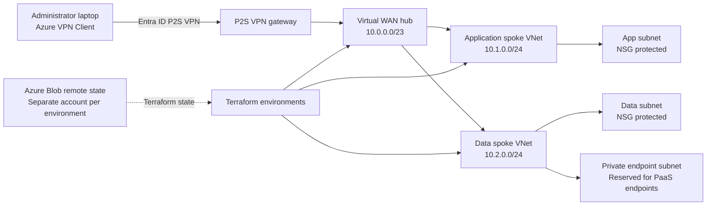

# ☁️ Enterprise Azure Hybrid Cloud Platform

### Production-Style Azure Networking & Infrastructure Automation with Terraform

[](#)
[](#)
[](#)
[](#)
[](#)
[](#)
[](#)
[](#)
[](#)
[](#)
[](#)
[](#)
[](#)
[](#)
[](#)

> An enterprise-style Azure networking and infrastructure platform demonstrating **Terraform automation, Azure Virtual WAN, identity-driven access, environment isolation, secure remote state, CI/CD, OIDC authentication, infrastructure security scanning, drift detection, and real-world cloud troubleshooting.**

---

## 📌 Project Highlights

| Capability                 | Implementation                       |
| -------------------------- | ------------------------------------ |
| ☁️ Cloud Platform          | Microsoft Azure                      |
| 🏗️ Infrastructure as Code | Terraform                            |
| 🌐 Network Architecture    | Azure Virtual WAN + Virtual Hub      |
| 🔀 Network Topology        | Hub-and-spoke                        |
| 🔐 Identity                | Microsoft Entra ID                   |
| 🔑 Access Control          | Azure RBAC                           |
| 🔒 Remote Access           | Entra ID authenticated P2S VPN       |
| 🛡️ Network Security       | NSGs + private endpoint architecture |
| 🗃️ Terraform State        | Azure Blob Storage                   |
| 🔄 Environments            | Dev / Test / Prod                    |
| 🤖 CI/CD                   | GitHub Actions                       |
| 🔐 CI Authentication       | GitHub OIDC                          |
| 🧪 IaC Quality             | Terraform Validate + TFLint          |
| 🛡️ Security Scanning      | Checkov + Trivy                      |
| 📈 Operations              | Drift Detection                      |
| ⚙️ Automation              | PowerShell + Azure CLI               |

---

# 🏗️ Architecture

The following Mermaid diagram represents the **currently implemented Azure topology**.



### 🔎 Topology Overview

| Component                   | CIDR / Purpose                                 |
| --------------------------- | ---------------------------------------------- |
| **Azure Virtual WAN**       | Centralized networking layer                   |
| **Virtual WAN Hub**         | `10.0.0.0/23`                                  |
| **Application Spoke VNet**  | `10.1.0.0/24`                                  |
| **Data Spoke VNet**         | `10.2.0.0/24`                                  |
| **Application Subnet**      | NSG protected                                  |
| **Data Subnet**             | NSG protected                                  |
| **Private Endpoint Subnet** | Reserved for PaaS private endpoints            |
| **P2S VPN**                 | Entra ID authenticated administrator access    |
| **Terraform State**         | Azure Blob Storage with environment separation |

> **Implementation note:** The Mermaid diagram reflects the topology currently implemented in this repository. A finalized Draw.io or PNG architecture diagram is planned as a future enhancement and is intentionally not represented as an existing deliverable.

---

# 🚀 Getting Started

Want to run the project?

There are two paths depending on whether you want to **quickly inspect the Terraform** or **deploy the Azure platform**.

| Path                     | Purpose                        | State Backend | Best For               |
| ------------------------ | ------------------------------ | ------------- | ---------------------- |
| 🟢 **Demo**              | Inspect and validate Terraform | Local         | Recruiters / reviewers |
| 🔵 **Azure Environment** | Deploy the full platform       | Azure Blob    | Engineers / deployment |

---

## 🟢 Option 1 — Quick Demo

The demo environment is the fastest way to explore the Terraform without configuring Azure remote state.

### Prerequisites

Install:

* Terraform
* Git
* PowerShell 7+

Verify your tools:

```powershell
terraform version
git --version
pwsh --version
```

### Clone the Repository

```powershell
git clone <REPOSITORY_URL>
cd azure-hybrid-cloud-project
```

### Initialize Terraform

```powershell
cd demo
terraform init
```

### Validate

```powershell
terraform validate
```

### Generate a Plan

```powershell
terraform plan
```

The demo path uses **local Terraform state** and intentionally avoids the Azure Blob Storage authentication and RBAC requirements of the full deployment.

> **Want to see the project quickly? Start here.**

---

# 🔵 Option 2 — Deploy the Azure Platform

The full Azure environments use **Azure Blob Storage for remote Terraform state**.

### Prerequisites

You will need:

* An Azure subscription
* Azure CLI
* Terraform
* PowerShell 7+
* Appropriate Azure permissions

Verify:

```powershell
az version
terraform version
```

---

## 1. Authenticate to Azure

```powershell
az login
```

Verify the active subscription:

```powershell
az account show
```

If you have multiple subscriptions:

```powershell
az account set --subscription "<SUBSCRIPTION_ID>"
```

---

## 2. Bootstrap Terraform Remote State

Terraform must be able to access its backend **before Terraform can initialize**.

The backend bootstrap process is designed to verify and/or configure:

* Azure authentication
* Azure subscription
* Terraform state resource group
* Storage account
* `tfstate` container
* Blob data-plane permissions
* Backend configuration
* State access

Run:

```powershell
cd scripts
.\Bootstrap-Backend.ps1
```

### Why Bootstrap the Backend?

A common Terraform Azure failure occurs when the backend references the wrong storage account, the state container does not exist, or the authenticated identity lacks Blob data-plane permissions.

The bootstrap process is intended to make backend setup **repeatable, validated, and easier to troubleshoot**.

---

## 3. Initialize Development

```powershell
cd environments/dev
terraform init
```

Validate:

```powershell
terraform validate
```

Generate a plan:

```powershell
terraform plan
```

Review the plan before applying:

```powershell
terraform apply
```

---

## 4. Test Environment

The test environment maintains its own configuration and Terraform state.

```powershell
cd environments/test
terraform init
terraform validate
terraform plan
```

---

## 5. Production Environment

Production is intentionally separated from development and test.

```powershell
cd environments/prod
terraform init
terraform validate
terraform plan
```

Production infrastructure should be deployed through the controlled GitHub Actions workflow rather than treated as an unrestricted local deployment.

---

# ⚠️ Terraform Remote State Authentication

One of the most important lessons from building this project:

> **Successfully authenticating to Azure does not automatically grant Terraform permission to access Azure Blob Storage data.**

Azure separates the **management plane** from the **data plane**.

```text
Management Plane
       │
       ▼
Azure Resources
```

versus:

```text
Data Plane
       │
       ▼
Blob Data
```

Terraform's AzureRM backend requires access to the Blob data plane.

Therefore:

```powershell
az login
```

being successful does **not** necessarily mean:

```powershell
terraform init
```

will succeed.

---

## 🔐 Understanding 401 vs 403 vs 404

| Error                                 | Meaning                                               | Typical Cause                                       |
| ------------------------------------- | ----------------------------------------------------- | --------------------------------------------------- |
| `401 Unauthorized`                    | Authentication failed                                 | Invalid or missing authentication                   |
| `403 AuthorizationPermissionMismatch` | Identity authenticated but lacks required data access | Missing Blob RBAC                                   |
| `404 Resource Not Found`              | Backend resource cannot be found                      | Wrong resource group, storage account, or container |

For Terraform remote state, the executing identity requires an appropriate Azure Storage data-plane role such as:

```text
Storage Blob Data Contributor
```

### The Troubleshooting Model

```text
Azure Login
     │
     ▼
Correct Subscription
     │
     ▼
Correct Resource Group
     │
     ▼
Correct Storage Account
     │
     ▼
Correct Container
     │
     ▼
Blob Data RBAC
     │
     ▼
terraform init
```

---

# 🧠 Engineering Lessons

This project was built around several real-world infrastructure lessons.

## 1. Management Plane ≠ Data Plane

Being able to manage or view an Azure Storage Account does not automatically provide permission to read and write Blob data.

Terraform remote state depends on **Blob data-plane authorization**.

---

## 2. Authentication ≠ Authorization

A valid Azure login proves identity.

It does not prove that the identity has permission to perform every operation required by Terraform.

```text
Identity
   │
   ▼
Authentication
   │
   ▼
Authorization
   │
   ▼
Resource Access
```

---

## 3. Never Trust Stale Backend Configuration

Terraform backend configuration can reference infrastructure that no longer exists.

Before debugging Terraform itself, verify:

* Subscription
* Resource group
* Storage account
* Container
* State key

This project encountered exactly this class of issue during development.

The resolution was to compare the Terraform backend configuration against the **actual Azure resources**, rather than assuming the configuration was still accurate.

---

## 4. Local and CI Authentication Are Different

Local development can authenticate through:

```text
Azure CLI
```

while GitHub Actions can authenticate through:

```text
GitHub Actions
      │
      ▼
OIDC
      │
      ▼
Microsoft Entra ID
      │
      ▼
Azure
```

These are different authentication workflows and should be configured accordingly.

---

## 5. Infrastructure Must Be Reproducible

A cloud environment should not depend on undocumented manual steps.

This project therefore emphasizes:

* Terraform
* Modular architecture
* Backend bootstrap
* Environment isolation
* Automated validation
* CI/CD
* Security scanning
* Drift detection
* Operational documentation

---

# 🌐 Network Architecture

## Azure Virtual WAN

Azure Virtual WAN provides the centralized networking layer.

```text
                     Azure Virtual WAN
                             │
                     ┌───────▼───────┐
                     │  Virtual Hub  │
                     │  10.0.0.0/23  │
                     └───────┬───────┘
                             │
              ┌──────────────┴──────────────┐
              │                             │
              ▼                             ▼
      Application Spoke               Data Spoke
        10.1.0.0/24                   10.2.0.0/24
```

The application and data workloads are separated into independent VNets.

---

# 🔐 Identity & Access

Identity is a core component of the platform.

The project uses **Microsoft Entra ID** for identity-driven access.

Azure RBAC provides authorization for Azure resources and data-plane operations.

The P2S VPN uses Entra ID authentication for administrator connectivity.

---

## 🔑 P2S VPN Access Flow

```text
Administrator Laptop
        │
        ▼
Azure VPN Client
        │
        ▼
Microsoft Entra ID
        │
        ▼
P2S VPN
        │
        ▼
Virtual WAN Hub
        │
        ├──────────► Application Spoke
        │
        └──────────► Data Spoke
```

This provides authenticated administrative access through the VPN architecture rather than directly exposing management services to the public internet.

---

# 🔒 Network Security

Network segmentation is implemented using:

* Application subnet
* Data subnet
* Network Security Groups
* Private endpoint subnet reservation
* Virtual WAN routing

The architecture separates application and data workloads while providing centralized connectivity through the Virtual WAN hub.

---

# 🔗 Private Endpoints

The data spoke contains a dedicated subnet reserved for private endpoints.

```text
Data VNet
│
├── Data Subnet
│
└── Private Endpoint Subnet
       │
       └── PaaS Private Connectivity
```

This establishes the network foundation for connecting Azure PaaS services through private networking.

---

# 🧱 Terraform Architecture

The project uses reusable Terraform modules rather than placing the entire platform into one monolithic configuration.

```text
modules/
│
├── backup/
├── governance/
├── identity/
├── monitoring/
└── network/
```

This allows infrastructure components to be reused across environments while keeping environment-specific configuration separate.

---

# 📁 Repository Structure

```text
.
├── environments/
│   ├── dev/
│   ├── test/
│   └── prod/
│
├── modules/
│   ├── backup/
│   ├── governance/
│   ├── identity/
│   ├── monitoring/
│   └── network/
│
├── demo/
│
├── scripts/
│   └── Bootstrap-Backend.ps1
│
├── .github/
│   └── workflows/
│       ├── terraform-quality.yml
│       ├── terraform-plan.yml
│       ├── terraform-apply.yml
│       ├── terraform-destroy-plan.yml
│       ├── terraform-destroy-apply.yml
│       └── drift-detection.yml
│
├── .gitignore
├── README.md
└── LICENSE
```

---

# 🗃️ Environment Isolation

Development, test, and production maintain separate Terraform configurations and state.

```text
                    Terraform Code
                          │
             ┌────────────┼────────────┐
             │            │            │
             ▼            ▼            ▼
            DEV          TEST         PROD
             │            │            │
             ▼            ▼            ▼
         State #1      State #2      State #3
```

This reduces the risk of one environment accidentally manipulating another environment's Terraform state.

---

# ☁️ Remote Terraform State

Azure Blob Storage provides remote Terraform state for the real environments.

```text
Azure Storage
│
├── Development
│   └── dev.terraform.tfstate
│
├── Test
│   └── test.terraform.tfstate
│
└── Production
    └── prod.terraform.tfstate
```

Each environment uses an isolated state location.

This provides:

* Environment separation
* Centralized state storage
* Consistent backend management
* Reduced risk of cross-environment state manipulation

---

# 🤖 GitHub Actions CI/CD

Infrastructure changes are integrated with GitHub Actions.

The workflow separates **validation, planning, and deployment**.

```text
Git Push
   │
   ▼
Terraform Format
   │
   ▼
Terraform Validate
   │
   ▼
TFLint
   │
   ▼
Checkov
   │
   ▼
Trivy
   │
   ▼
Terraform Plan
   │
   ▼
Review
   │
   ▼
Controlled Apply
```

---

# 🔑 GitHub OIDC

The CI/CD architecture uses GitHub Actions OIDC rather than relying on long-lived Azure credentials.

```text
GitHub Actions
      │
      │ OIDC Token
      ▼
Microsoft Entra ID
      │
      │ Federated Identity
      ▼
Azure
      │
      ▼
Terraform
```

This provides an identity-based authentication model for CI/CD and reduces dependence on long-lived cloud credentials.

---

# 🛡️ Security & Quality Scanning

The project incorporates multiple validation layers.

### Terraform Validate

Checks Terraform configuration correctness.

### TFLint

Performs Terraform linting and configuration quality checks.

### Checkov

Performs infrastructure-as-code security analysis.

### Trivy

Provides security scanning for applicable infrastructure and container artifacts.

Together:

```text
Terraform
    │
    ├── Terraform Validate
    ├── TFLint
    ├── Checkov
    └── Trivy
```

The goal is to detect configuration, quality, and security issues before infrastructure changes are deployed.

---

# 🔄 Drift Detection

Infrastructure can change outside Terraform.

The project therefore includes automated drift detection.

```text
Scheduled GitHub Action
        │
        ▼
terraform plan
        │
        ▼
Compare Terraform
       vs
Azure Infrastructure
        │
        ▼
Detect Drift
```

This provides an additional control for identifying infrastructure that no longer matches the declared Terraform configuration.

---

# 🧯 Controlled Apply & Destroy

Infrastructure changes are intentionally separated into planning and execution stages.

### Apply

```text
Terraform Plan
      │
      ▼
Review
      │
      ▼
Terraform Apply
```

### Destroy

```text
Destroy Plan
      │
      ▼
Review / Confirmation
      │
      ▼
Destroy Apply
```

This reduces the likelihood of accidental destructive operations.

---

# 🔍 Plan Artifact Integrity

The CI/CD design associates Terraform plans with the source revision that produced them.

```text
Git Commit
    │
    ▼
Terraform Plan
    │
    ▼
Plan Artifact
    │
    ▼
Review
    │
    ▼
Apply
```

The objective is to ensure the infrastructure being applied corresponds to the infrastructure that was reviewed.

---

# 🧪 Testing & Validation

The project uses multiple levels of validation.

## Terraform Validation

```powershell
terraform fmt -check
terraform validate
terraform plan
```

## Static Analysis

```text
TFLint
Checkov
Trivy
```

## Azure Validation

The deployed environment can be validated through:

* Azure resource configuration
* Network configuration
* RBAC
* Storage access
* VPN configuration

---

# 📡 Connectivity Validation

The P2S VPN control plane has been validated through Azure configuration and authentication.

Packet-level workload testing remains environment-dependent because Azure VM SKU availability, regional quota, and capacity can affect the ability to provision test workloads.

This distinction is intentional:

> **A successful Terraform deployment does not automatically prove end-to-end application traffic.**

The project documents this distinction rather than presenting control-plane validation as proof of complete workload connectivity.

---

# 🧠 Troubleshooting Lessons

## Backend Resource Mismatch

One of the practical challenges encountered during development was stale Terraform backend configuration pointing toward state resources that did not match the currently deployed Azure Storage infrastructure.

The resolution process was:

```text
Check Terraform Backend
        ↓
Verify Azure Resource Group
        ↓
Verify Storage Account
        ↓
Verify Container
        ↓
Verify Authentication
        ↓
Verify Blob RBAC
        ↓
Reinitialize Terraform
```

This reinforced the importance of validating the actual Azure environment instead of assuming the Terraform configuration represents reality.

---

## `401 Unauthorized`

Typical investigation:

```powershell
az login
az account show
```

Then verify the backend authentication configuration and identity being used.

---

## `403 AuthorizationPermissionMismatch`

A `403` indicates that the identity reached Azure Storage but lacked the necessary data-plane permission.

Check the identity's Azure RBAC assignment.

For Terraform state, an appropriate role may include:

```text
Storage Blob Data Contributor
```

---

## `404 Resource Not Found`

Verify:

```text
Subscription
Resource Group
Storage Account
Container
```

A `404` commonly indicates that Terraform is targeting a backend resource that does not exist or does not match the intended environment.

---

# 🚦 Deployment Workflow

## Local Development

```text
terraform fmt
      ↓
terraform init
      ↓
terraform validate
      ↓
terraform plan
      ↓
Review
      ↓
terraform apply
```

## CI/CD

```text
Pull Request
     ↓
Quality Checks
     ↓
Security Scanning
     ↓
Terraform Plan
     ↓
Review
     ↓
Approval
     ↓
Terraform Apply
```

---

# 🧹 Destroying Infrastructure

For development and test environments:

```powershell
terraform plan -destroy
```

Review the destruction plan carefully.

Then:

```powershell
terraform destroy
```

Production destruction should remain subject to the repository's controlled CI/CD workflow.

---

# 📊 Technology Stack

## ☁️ Cloud

* Microsoft Azure
* Azure Virtual WAN
* Azure Virtual Hub
* Azure VNets
* Azure Storage

## 🌐 Networking

* Hub-and-spoke architecture
* Virtual WAN routing
* P2S VPN
* Network Security Groups
* Private endpoint architecture
* Network segmentation

## 🏗️ Infrastructure as Code

* Terraform
* Terraform modules
* Remote state
* Environment isolation
* Drift detection

## 🔐 Identity & Security

* Microsoft Entra ID
* Azure RBAC
* GitHub OIDC
* Federated identity
* Checkov
* Trivy

## 🤖 DevOps

* GitHub Actions
* Terraform CI/CD
* Automated validation
* Plan artifacts
* Controlled deployment
* Destructive-operation controls

## ⚙️ Automation

* PowerShell
* Azure CLI
* Terraform automation

---

# 🎯 What This Project Demonstrates

This repository demonstrates practical experience with:

### Cloud Architecture

* Designing Azure network architecture
* Building hub-and-spoke environments
* Implementing Azure Virtual WAN
* Separating application and data networks

### Infrastructure as Code

* Automating infrastructure with Terraform
* Designing reusable Terraform modules
* Managing remote Terraform state
* Isolating environments
* Detecting infrastructure drift

### Identity & Security

* Implementing Microsoft Entra ID authentication
* Configuring P2S VPN access
* Applying Azure RBAC
* Understanding management-plane vs data-plane authorization
* Implementing OIDC authentication
* Performing infrastructure security scanning

### DevOps

* Implementing GitHub Actions CI/CD
* Automating Terraform validation
* Generating and reviewing Terraform plans
* Controlling infrastructure applies
* Protecting destructive workflows

### Operations

* Troubleshooting Terraform backend failures
* Diagnosing `401`, `403`, and `404` errors
* Validating Azure resource configuration
* Designing repeatable infrastructure workflows
* Documenting operational procedures

---

# 🏆 Engineering Takeaways

The most important lesson from this project is that **cloud engineering is more than provisioning resources**.

A production-style platform requires understanding how:

```text
Networking
     +
Identity
     +
Security
     +
Infrastructure as Code
     +
State Management
     +
CI/CD
     +
Governance
     +
Monitoring
     +
Troubleshooting
     +
Recovery
```

fit together.

The project therefore focuses not only on **building infrastructure**, but also on making that infrastructure:

> **Secure · Reproducible · Automated · Testable · Recoverable · Understandable**

by the next engineer.

---

# 🔮 Future Enhancements

Potential future improvements include:

* Azure Firewall
* Azure Bastion
* Private DNS architecture
* Expanded Azure Monitor / Log Analytics
* Centralized security monitoring
* Azure Policy
* Policy-as-Code
* Management Groups
* Cost governance
* Additional workload deployments
* Kubernetes integration
* Containerized workloads
* Advanced observability
* Finalized Draw.io architecture diagram
* PNG architecture export

---

# 👨‍💻 About

Built by **Ryan Golden** as a hands-on demonstration of Azure cloud networking, infrastructure automation, security, identity, and DevOps engineering.

The project is designed to demonstrate the complete infrastructure lifecycle:

```text
DESIGN
  ↓
ARCHITECT
  ↓
AUTOMATE
  ↓
SECURE
  ↓
VALIDATE
  ↓
DEPLOY
  ↓
MONITOR
  ↓
TROUBLESHOOT
  ↓
RECOVER
  ↓
IMPROVE
```

---

# ⭐ Final Takeaway

This repository is more than a collection of Terraform resources.

It demonstrates an approach to cloud infrastructure as an engineering system:

**Versioned. Automated. Secured. Tested. Observable. Recoverable.**

The architecture, CI/CD workflows, identity model, remote-state strategy, security controls, and troubleshooting documentation are designed to demonstrate how modern cloud infrastructure is **engineered, validated, deployed, and operated**.
