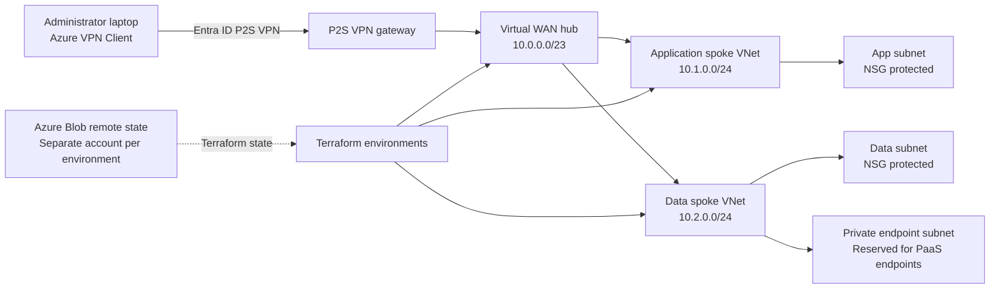

# Azure Virtual WAN Hybrid Cloud Architecture

A Terraform-managed Azure hub-and-spoke environment with Virtual WAN, Entra ID-authenticated point-to-site VPN, isolated environments, protected remote state, and documented validation procedures.

## Architecture Diagram



The Mermaid diagram above reflects the currently implemented topology. A finalized Draw.io or PNG diagram remains a future enhancement.

## Overview

This project demonstrates a reusable Azure infrastructure platform built with Terraform:

- Azure Virtual WAN and Virtual Hub for centralized connectivity
- Application and data spoke workload subnets with NSG protection
- Entra ID-authenticated P2S VPN for administrator access
- Dedicated subnet reserved for future private endpoints
- Separate dev, test, and prod environments with isolated Terraform state
- Governance, managed identity, monitoring, and backup modules
- GitHub Actions validation and OIDC-based plan workflows
- Validation and troubleshooting documentation under `docs/`

The network, VPN control plane, environment isolation, Terraform validation, and plan workflows have been tested. A packet-level workload test remains pending an Azure-side target because the current subscription does not have a suitable VM SKU/quota available in East US.

## Repository Structure

```text
azure-hybrid-cloud-project/
├── .github/
│   └── workflows/
│       ├── terraform-quality.yml
│       ├── terraform-plan.yml
│       ├── terraform-apply.yml
│       ├── terraform-destroy-plan.yml
│       └── terraform-destroy-apply.yml
├── demo/                         # Local-state, sanitized validation entry point
├── docs/
│   ├── troubleshooting.md
│   └── validation/
│       └── test.md
├── environments/
│   ├── dev/                      # Development root module and backend
│   ├── test/                     # Test root module and backend
│   └── prod/                     # Production root module and backend
├── modules/
│   ├── backup/                   # Recovery Services vault and VM policy
│   ├── governance/               # Audit-only environment tag policy
│   ├── identity/                 # User-assigned managed identity
│   ├── monitoring/               # Log Analytics workspace and network diagnostics
│   └── network/                  # Virtual WAN, hub, spokes, VPN, and NSGs
├── scripts/
│   └── Bootstrap-Backend.ps1     # Creates Azure Terraform state storage
├── .gitignore
└── README.md
```

## Prerequisites

- Azure subscription with permission to create the listed resources
- PowerShell 7+ (`pwsh`)
- Terraform CLI 1.7 or later
- Azure PowerShell `Az` module for backend bootstrap:
  `Install-Module -Name Az -Scope CurrentUser -Repository PSGallery -Force`
- Azure CLI for Entra-authenticated local Terraform state access
- Microsoft Entra ID account
- Azure VPN Client for P2S testing on Windows

## Environment and State Design

Each environment uses a separate Azure Storage account, resource group, container, and state key. This prevents state overlap and creates an independent recovery boundary:

| Environment | Backend resource group | Storage account | Container | State key |
|---|---|---|---|---|
| dev | `rg-tfstate-dev01ahcps` | `sttfstatedev01ahcps` | `tfstate` | `dev.terraform.tfstate` |
| test | `rg-tfstate-test01ahcps` | `sttfstatetest01ahcps` | `tfstate` | `test.terraform.tfstate` |
| prod | `rg-tfstate-prod03ahcps` | `sttfstateprod03ahcps` | `tfstate` | `prod.terraform.tfstate` |

The `ahcps` suffix makes the storage account names globally unique while preserving the environment identifiers `dev01`, `test01`, and `prod03`. Separate storage accounts were chosen because they provide a clearer security and recovery boundary than sharing one account for every environment.

## Backend Protection

The backend bootstrap script configures the following settings:

- StorageV2 account
- Standard LRS redundancy
- HTTPS and TLS 1.2
- Blob public access disabled
- Dedicated `tfstate` container

For production use, enable and verify Blob versioning, blob soft delete, container soft
delete, and change feed on each state storage account.

Authenticate to Azure in PowerShell:

```powershell
Connect-AzAccount
az login
```

Create backend storage separately for each environment:

```powershell
.\scripts\Bootstrap-Backend.ps1 -Suffix dev01ahcps -Environment dev
.\scripts\Bootstrap-Backend.ps1 -Suffix test01ahcps -Environment test
.\scripts\Bootstrap-Backend.ps1 -Suffix prod03ahcps -Environment prod
```

Deploy one environment at a time, starting with `dev` and reviewing each plan:

```powershell
Set-Location .\environments\dev
Copy-Item terraform.tfvars.example terraform.tfvars
terraform init -reconfigure
terraform validate
terraform plan
terraform apply
```

Use the corresponding environment directory for `test` or `prod`. Never run an apply
from the wrong environment directory, and never commit `terraform.tfvars`, state files,
credentials, or storage keys.

The repository has passed formatting, initialization, validation, and plan checks for the
real environments. The local commands are:

```powershell
terraform fmt -check -recursive
terraform init -input=false -reconfigure
terraform validate
terraform plan -input=false -lock-timeout=5m
```

### P2S Control-Plane Validation

The test environment P2S control plane was validated with Azure VPN Client:

- Entra ID authentication succeeded
- The VPN gateway was reachable and attached
- The laptop received VPN address `172.16.0.130`
- Routes for the hub, app spoke, data spoke, and VPN pool were received
- Azure VPN Client reached `Connected`
- Azure Portal reported the active P2S session when refreshed promptly

See [docs/validation/test.md](docs/validation/test.md) for the recorded evidence and procedure.

### End-to-End Traffic Validation

End-to-end packet flow requires an Azure-side private target, such as a VM or private endpoint. The temporary VM attempt was removed after East US capacity, SKU availability, and quota restrictions prevented deployment. The P2S control-plane result is confirmed; workload traffic validation is documented as future work.

- Pull requests and pushes to `main` run formatting, backend-free validation for `demo`,
  `dev`, `test`, and `prod`, TFLint, advisory Checkov, and Trivy scans. Cloud-backed plans
  remain manual so pull-request code does not run with Azure credentials
- Scheduled daily drift detection for `dev`, `test`, and `prod` that opens or updates a
  GitHub issue when the live environment differs from configuration, and auto-closes it
  once reconciled
- Automatic GitHub issue creation when a `Terraform Apply` or `Terraform Destroy Apply`
  run fails, linking to the failed run
- Optional SonarCloud analysis when the repository variable `SONAR_ORGANIZATION`,
  repository variable `SONAR_PROJECT_KEY`, and secret `SONAR_TOKEN` are configured
- Manual environment plans for dev, test, and prod using OIDC
- Production apply and destroy require a successful Terraform Quality run for the exact
  source commit, require the workflow definition from `main`, and verify the matching
  successful plan workflow run/artifact before execution
- Saved binary Terraform plan artifacts with seven-day retention
- Plan text written to the GitHub Actions job summary
- Apply checks out and verifies the exact source commit recorded with the plan
- Shared per-environment concurrency groups serialize plans, applies, drift checks, and
  destroys so workflows cannot operate on the same state concurrently
- Manual environment selection for dev, test, and prod
- An apply workflow that downloads and applies the exact saved plan artifact
- Separate manual destroy-plan and destroy-apply workflows using reviewed artifacts
- Typed `DESTROY` confirmation for destructive operations
- Entra federation configured for the GitHub environments used by each workflow
- Separate state access through `Storage Blob Data Contributor`

Manual apply confirmation is implemented through the required `APPLY` or `CANCEL`
workflow input. Main branch protection is not enabled because GitHub only offers branch
protection rules on private repositories with a Pro, Team, or Enterprise plan; this
repository is currently on the Free plan. GitHub Environment required reviewers require
an Enterprise plan for private repositories. Confirmed by attempting to configure branch
protection through the GitHub API, which returned `403 Upgrade to GitHub Pro or make this
repository public to enable this feature`.
The apply workflow should be run only with the environment, plan run ID, and exact source
commit that were reviewed. It verifies the commit recorded in the plan artifact before
applying and never generates a new plan during apply.

Destroy is never triggered by a push or pull request. The destroy process requires a
successful manual destroy plan, review of its saved artifact, the matching plan run ID
and source commit, and an explicit `DESTROY` confirmation in the destroy-apply workflow.

The repository should not be presented as having independently approval-gated production
deployment. That remains pending a paid GitHub plan or a repository visibility/configuration
change that supports the required controls.

See [docs/rollback-runbook.md](docs/rollback-runbook.md) for the incident response and
rollback procedure covering failed applies, failed destroys, and detected drift.

Trivy scans this Terraform repository directly. Cosign is not included yet because this
repository does not build or publish a container image; Cosign should be added alongside a
container build workflow so it can sign and verify an actual image digest.

## Troubleshooting

See [docs/troubleshooting.md](docs/troubleshooting.md) for Azure VPN Client diagnostics, P2S session checks, quota failures, and the future end-to-end traffic test procedure.

## Future Enhancements

- Add a supported private workload target for packet-level VPN validation
- Add private endpoint resources and private DNS integration
- Restrict backend network access after all required identities are known
- Enable GitHub-enforced branch and environment approval gates for production apply after
  upgrading to a paid GitHub plan or changing repository visibility/configuration
- Add alert rules to the monitoring module
- Add VM backup association when a protected VM exists
- Add CAF and Well-Architected Framework mapping
- Add a finalized Draw.io architecture diagram