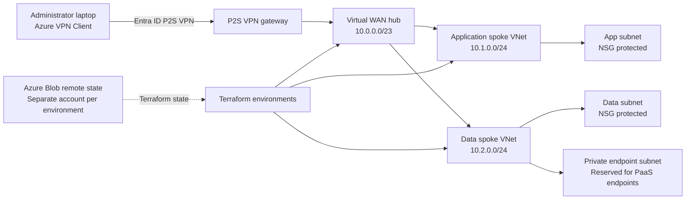

# ☁️ Enterprise Azure Hybrid Cloud Platform

### Production-Style Azure Networking & Infrastructure Automation with Terraform

[](#)
[](#)
[](#)
[](#)
[](#)
[](#)
[](#)
[](#)
[](#)
[](#)
[](#)
[](#)
[](#)
[](#)
[](#)
> An enterprise-style Azure hybrid cloud platform demonstrating secure networking, infrastructure-as-code, identity-driven access, environment isolation, remote state management, CI/CD automation, security scanning, and operational troubleshooting.

---

## 🏗️ Architecture Diagram

The following Mermaid diagram represents the **currently implemented Azure topology**.



---

# 🚀 Getting Started

Want to actually run the project?

Start here.

There are **two deployment paths**, depending on what you want to accomplish.

| Path                     | Purpose                                | Remote State | Best For                    |
| ------------------------ | -------------------------------------- | ------------ | --------------------------- |
| 🟢 **Demo**              | Quickly inspect and validate Terraform | Local        | Recruiters / reviewers      |
| 🔵 **Azure Environment** | Deploy the full platform               | Azure Blob   | Engineers / real deployment |

---

## 🟢 Option 1 — Quick Demo

This is the fastest way to explore the Terraform without configuring Azure remote state.

### Prerequisites

Install:

* Terraform
* Git
* PowerShell 7+

Verify:

```powershell
terraform version
git --version
pwsh --version
```

### Clone

```powershell
git clone <REPOSITORY_URL>
cd azure-hybrid-cloud-project
```

### Initialize

```powershell
cd demo
terraform init
```

### Validate

```powershell
terraform validate
```

### Generate a Plan

```powershell
terraform plan
```

This path uses local Terraform state and is intentionally designed to avoid requiring Azure Blob Storage authentication or RBAC configuration.

---

# 🔵 Option 2 — Deploy the Azure Platform

To deploy the actual Azure environment, you will need:

* An Azure subscription
* Azure CLI
* Terraform
* PowerShell 7+
* Appropriate Azure permissions

Verify:

```powershell
az version
terraform version
```

---

## 1. Authenticate to Azure

```powershell
az login
```

Verify the active subscription:

```powershell
az account show
```

If you have multiple subscriptions:

```powershell
az account set --subscription "<SUBSCRIPTION_ID>"
```

---

## 2. Bootstrap Terraform Remote State

The production-style environments use Azure Blob Storage for Terraform state.

Run the backend bootstrap script:

```powershell
cd scripts
.\Bootstrap-Backend.ps1
```

The bootstrap process is designed to verify and/or configure:

* Azure authentication
* Subscription
* Resource group
* Storage account
* `tfstate` container
* Blob data-plane permissions
* Backend configuration
* State access

> **Why bootstrap?**
> Terraform must access its backend before it can initialize. Automating backend creation and validation prevents common `401 Unauthorized`, `403 AuthorizationPermissionMismatch`, and `404 Resource Not Found` failures caused by incorrect state configuration or missing Blob permissions.

---

## 3. Initialize an Environment

For development:

```powershell
cd environments/dev
terraform init
```

Then:

```powershell
terraform validate
terraform plan
```

Review the plan before applying.

```powershell
terraform apply
```

---

## 4. Test / Production

The same workflow applies to the other environments:

```text
environments/
├── dev/
├── test/
└── prod/
```

Each environment maintains independent Terraform state.

```powershell
cd environments/test
terraform init
terraform validate
terraform plan
```

Production should be deployed through the controlled CI/CD workflow rather than treated as an unrestricted local deployment.

---

## ⚠️ Important: Terraform State Authentication

One of the key lessons demonstrated by this project is that:

```text
az login
```

does **not** automatically mean Terraform has permission to access Azure Blob Storage.

Azure separates:

**Management-plane permissions**

from:

**Blob data-plane permissions**

For remote Terraform state, the executing identity requires appropriate Blob Storage RBAC permissions.

Common symptoms:

| Error                                 | Typical Cause                      |
| ------------------------------------- | ---------------------------------- |
| `401 Unauthorized`                    | Authentication/session problem     |
| `403 AuthorizationPermissionMismatch` | Missing Blob data-plane RBAC       |
| `404 Resource Not Found`              | Incorrect/missing backend resource |

This distinction is documented because it is one of the most common sources of confusion when configuring Terraform's AzureRM backend.

---

## 🎯 What You Can Explore After Deployment

Once the environment is deployed, explore:

### Networking

* Azure Virtual WAN
* Virtual Hub
* Application spoke
* Data spoke
* Routing
* NSGs
* Private endpoint architecture

### Identity

* Entra ID
* P2S VPN authentication
* Azure RBAC
* OIDC

### Infrastructure as Code

* Terraform modules
* Environment isolation
* Remote state
* State recovery
* Drift detection

### DevOps

* GitHub Actions
* Terraform plan/apply workflows
* Security scanning
* Automated validation
* Controlled production deployment

---

## 📸 Architecture at a Glance

```text
                    ┌─────────────────────┐
                    │    GitHub Actions   │
                    │ Terraform / OIDC    │
                    └──────────┬──────────┘
                               │
                               ▼
                    ┌─────────────────────┐
                    │    Azure Platform   │
                    │                     │
                    │   Virtual WAN Hub   │
                    │      10.0.0.0/23    │
                    └──────────┬──────────┘
                               │
                  ┌────────────┴────────────┐
                  ▼                         ▼
          ┌───────────────┐         ┌───────────────┐
          │ Application   │         │ Data          │
          │ 10.1.0.0/24   │         │ 10.2.0.0/24   │
          └───────────────┘         └───────────────┘
                  │                         │
                  ▼                         ▼
                NSGs                NSGs / Private EP
```

---

# 📖 Continue Exploring

After getting the project running, the rest of this README explains the engineering decisions behind the platform:

* **Architecture**
* **Network Design**
* **Identity & Access**
* **Terraform Modules**
* **Remote State**
* **GitHub Actions**
* **OIDC**
* **Security Scanning**
* **Drift Detection**
* **Testing & Validation**
* **Troubleshooting Lessons**
* **Future Enhancements**
