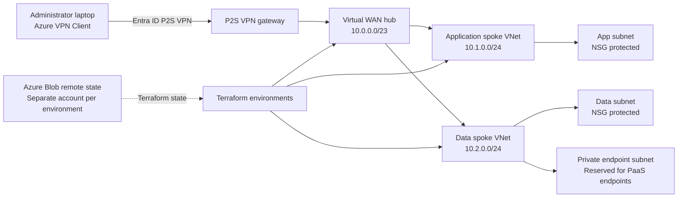

## 🏗️ Architecture Diagram

The following Mermaid diagram represents the **currently implemented Azure topology**.



### 🔎 Topology Overview

| Component                   | CIDR / Purpose                                 |
| --------------------------- | ---------------------------------------------- |
| **Azure Virtual WAN**       | Centralized networking layer                   |
| **Virtual WAN Hub**         | `10.0.0.0/23`                                  |
| **Application Spoke VNet**  | `10.1.0.0/24`                                  |
| **Data Spoke VNet**         | `10.2.0.0/24`                                  |
| **Application Subnet**      | NSG protected                                  |
| **Data Subnet**             | NSG protected                                  |
| **Private Endpoint Subnet** | Reserved for PaaS private endpoints            |
| **P2S VPN**                 | Entra ID authenticated administrator access    |
| **Terraform State**         | Azure Blob Storage with environment separation |

### 🔐 Traffic & Management Flow

The architecture separates **management access, workload networking, and Terraform state**:

```text
Administrator
     │
     │ Entra ID Authentication
     ▼
P2S VPN
     │
     ▼
Azure Virtual WAN Hub
     │
     ├──────────────► Application Spoke
     │
     └──────────────► Data Spoke
```

Terraform operates separately from application traffic:

```text
Terraform
    │
    ├──► Virtual WAN / Hub
    ├──► Application Spoke
    └──► Data Spoke

Terraform State
    │
    ▼
Azure Blob Storage
    │
    ├──► Dev State
    ├──► Test State
    └──► Prod State
```

This separation makes the architecture easier to reason about and reinforces the distinction between **Azure resource management, workload networking, and Terraform state management**.

> **Implementation note:** The Mermaid diagram reflects the topology currently implemented in this repository. A finalized Draw.io or PNG architecture diagram is planned as a future enhancement and is intentionally not represented as an existing deliverable.


# 🎯 What This Project Demonstrates

This repository demonstrates practical experience across several areas of cloud engineering.

| Area                 | Implementation                  |
| -------------------- | ------------------------------- |
| Cloud                | Microsoft Azure                 |
| IaC                  | Terraform                       |
| Networking           | Azure Virtual WAN               |
| Routing              | Virtual Hub                     |
| Network Architecture | Hub-and-Spoke                   |
| Compute Networking   | Application/Data Spokes         |
| Identity             | Microsoft Entra ID              |
| VPN                  | Point-to-Site VPN               |
| Security             | NSGs / RBAC / Private Endpoints |
| State Management     | Azure Blob Storage              |
| CI/CD                | GitHub Actions                  |
| Authentication       | OIDC                            |
| IaC Security         | Checkov                         |
| IaC Quality          | TFLint                          |
| Container Security   | Trivy                           |
| Drift Detection      | Automated Terraform checks      |
| Environments         | Dev / Test / Prod               |
| Automation           | PowerShell / Terraform          |
| Governance           | Modular Terraform architecture  |

---

# 🧠 Engineering Principles

The project was designed around several principles.

### 1. Identity over credentials

Azure resources should authenticate using identities whenever possible instead of long-lived access keys.

### 2. Infrastructure as Code

Infrastructure should be reproducible, reviewable, and version controlled.

### 3. Environment isolation

Development, testing, and production infrastructure should not share Terraform state.

### 4. Validate before deploying

Terraform should be validated and security-scanned before infrastructure changes are applied.

### 5. Least privilege

Access should be granted through Azure RBAC rather than broad administrator permissions.

### 6. Fail safely

Production changes require explicit workflow controls rather than automatically applying every commit.

### 7. Make infrastructure recoverable

Terraform state and deployment processes should account for recovery, drift, and failed deployments.

---

# 🌐 Network Architecture

## Azure Virtual WAN

The platform uses Azure Virtual WAN as the centralized networking layer.

```text
                     Azure Virtual WAN
                            │
                    ┌───────▼───────┐
                    │  Virtual Hub   │
                    │  10.0.0.0/23  │
                    └───────┬────────┘
                            │
             ┌──────────────┴──────────────┐
             │                             │
             ▼                             ▼
      Application Spoke              Data Spoke
        10.1.0.0/24                  10.2.0.0/24
```

This provides a centralized architecture for routing between network segments while keeping application and data workloads logically separated.

---

# 🔐 Identity & Access

Identity is a core part of this architecture.

The project uses:

**Microsoft Entra ID**

for identity-based authentication.

The P2S VPN is configured to authenticate users through Entra ID rather than relying exclusively on shared credentials.

Azure RBAC is also used for access to Terraform's remote state.

---

# 🔑 Terraform Remote State

Terraform state is stored in Azure Blob Storage.

Each environment has its own state configuration.

```text
Azure Storage
│
├── dev
│   └── dev.terraform.tfstate
│
├── test
│   └── test.terraform.tfstate
│
└── prod
    └── prod.terraform.tfstate
```

This prevents development changes from accidentally manipulating production state.

---

# ⚠️ The Terraform Backend Authentication Lesson

One of the most important lessons from building this project was that:

> **Terraform being able to authenticate to Azure does not automatically mean Terraform can access Azure Blob Storage data.**

These are different authorization layers.

```text
Azure CLI Authentication
        │
        ▼
Azure Resource Manager
        │
        ▼
Azure Storage Account
        │
        ▼
Blob Data Plane
        │
        ▼
Terraform State
```

A user can successfully run:

```powershell
az login
```

and still receive:

```text
401 Unauthorized
```

or:

```text
403 AuthorizationPermissionMismatch
```

when Terraform accesses the state container.

---

# 🧩 401 vs 403 vs 404

This project explicitly accounts for the difference between these failures.

### `401 Unauthorized`

Usually indicates an authentication problem.

Examples:

* Wrong authentication method
* Missing credentials
* Expired authentication
* Incorrect OIDC configuration

---

### `403 AuthorizationPermissionMismatch`

The identity successfully reached Azure Storage, but does not have the required **data-plane permission**.

For Terraform state access, the identity needs an appropriate Blob Storage RBAC role such as:

```text
Storage Blob Data Contributor
```

This is different from simply having permission to manage the Storage Account resource itself.

---

### `404 Resource Not Found`

Usually indicates an infrastructure/configuration mismatch.

Examples:

* Wrong resource group
* Wrong storage account name
* Wrong environment
* Deleted backend
* Stale Terraform backend configuration

---

# 🛠️ Backend Bootstrap

Remote Terraform state should not depend on manually remembering storage account names or recreating RBAC configuration.

The project therefore uses a backend bootstrap process designed to:

1. Verify Azure authentication
2. Verify the selected subscription
3. Create the Terraform state resource group
4. Create the Storage Account
5. Create the `tfstate` container
6. Configure Azure Blob access
7. Assign required Blob data permissions
8. Verify access
9. Generate/validate backend configuration
10. Initialize Terraform

The objective is to make backend setup **repeatable and idempotent**.

---

# 🧪 Frictionless Demo Mode

Remote state introduces legitimate Azure dependencies:

* Storage Account
* Blob container
* RBAC
* Authentication
* Subscription permissions

For recruiters or engineers who simply want to inspect the Terraform without configuring remote state, the project provides a **local-state demo path**.

```text
demo/
├── main.tf
├── variables.tf
├── outputs.tf
└── terraform.tfvars.example
```

The demo environment is intentionally designed so someone can:

```powershell
terraform init
terraform validate
terraform plan
```

without first configuring Azure Blob remote state.

This separates:

**Portfolio Demonstration**

from:

**Enterprise Remote-State Deployment**

---

# 📁 Repository Structure

```text
.
├── environments/
│   ├── dev/
│   ├── test/
│   └── prod/
│
├── modules/
│   ├── backup/
│   ├── governance/
│   ├── identity/
│   ├── monitoring/
│   └── network/
│
├── demo/
│
├── scripts/
│   └── Bootstrap-Backend.ps1
│
├── .github/
│   └── workflows/
│       ├── terraform-quality.yml
│       ├── terraform-plan.yml
│       ├── terraform-apply.yml
│       ├── terraform-destroy-plan.yml
│       ├── terraform-destroy-apply.yml
│       └── drift-detection.yml
│
├── .gitignore
├── README.md
└── LICENSE
```

---

# 🧱 Terraform Module Architecture

Terraform is organized into reusable modules instead of placing the entire platform into one monolithic configuration.

```text
modules/
│
├── network/
│   ├── virtual-wan
│   ├── virtual-hub
│   ├── spoke-vnets
│   ├── subnets
│   └── routing
│
├── identity/
│   ├── Entra integration
│   ├── RBAC
│   └── identity resources
│
├── monitoring/
│   └── monitoring resources
│
├── governance/
│   └── governance controls
│
└── backup/
    └── backup configuration
```

This makes individual components reusable across environments.

---

# 🔄 Environment Strategy

Each environment maintains independent Terraform configuration and state.

```text
                 Terraform Code
                       │
          ┌────────────┼────────────┐
          ▼            ▼            ▼
        DEV           TEST         PROD
          │            │            │
          ▼            ▼            ▼
      State #1      State #2      State #3
```

This prevents:

```text
DEV → accidentally modifies PROD state
```

and allows environments to evolve independently.

---

# 🤖 GitHub Actions CI/CD

The repository uses GitHub Actions to automate infrastructure quality checks and deployment workflows.

## Pull Request / Validation

```text
Git Push
   │
   ▼
Terraform Format
   │
   ▼
Terraform Validate
   │
   ▼
TFLint
   │
   ▼
Checkov
   │
   ▼
Trivy
   │
   ▼
Terraform Plan
```

---

# 🔐 GitHub OIDC

GitHub Actions does not rely on storing long-lived Azure client secrets in repository secrets.

Instead, the project uses:

**GitHub Actions → OIDC → Microsoft Entra ID → Azure**

```text
GitHub Actions
      │
      │ OIDC Token
      ▼
Microsoft Entra ID
      │
      │ Federated Identity
      ▼
Azure
      │
      ▼
Terraform
```

This eliminates the need to maintain long-lived Azure credentials for CI/CD.

---

# 🛡️ Security Scanning

Infrastructure is evaluated using multiple security and quality tools.

### TFLint

Terraform linting and configuration quality.

### Checkov

Infrastructure-as-code security analysis.

### Trivy

Security scanning where applicable to container/infrastructure artifacts.

### Terraform Validate

Configuration correctness.

The goal is to catch problems **before infrastructure reaches Azure**.

---

# 📊 Drift Detection

Infrastructure can change outside Terraform.

For that reason, the project includes automated drift detection.

```text
Scheduled GitHub Action
        │
        ▼
terraform plan
        │
        ▼
Compare:
Terraform State
      vs
Azure Infrastructure
        │
        ▼
Detect Drift
```

This provides an additional control against undocumented infrastructure changes.

---

# 🧯 Controlled Apply / Destroy

Production infrastructure should not be destroyed because somebody accidentally clicked the wrong button.

The CI/CD design separates:

```text
PLAN
```

from:

```text
APPLY
```

and:

```text
DESTROY PLAN
```

from:

```text
DESTROY APPLY
```

Destructive operations require explicit confirmation.

---

# 🔍 Plan Artifact Integrity

The CI/CD pipeline is designed around the principle that the plan being reviewed should be the plan being applied.

The workflow can associate the generated Terraform plan with the commit that produced it.

```text
Commit
  │
  ▼
Terraform Plan
  │
  ▼
Plan Artifact
  │
  ▼
Review
  │
  ▼
Apply
```

This reduces the risk of applying infrastructure generated from a different source revision.

---

# 🚦 Deployment Workflow

## Local Development

```text
terraform fmt
      ↓
terraform init
      ↓
terraform validate
      ↓
terraform plan
      ↓
Review
      ↓
terraform apply
```

---

## CI/CD

```text
Pull Request
     ↓
Quality Checks
     ↓
Security Scanning
     ↓
Terraform Plan
     ↓
Review
     ↓
Manual Approval
     ↓
Terraform Apply
```

---

# 🧪 Validation

The infrastructure was tested through multiple layers.

### Terraform Validation

```powershell
terraform fmt -check
terraform validate
terraform plan
```

### Static Analysis

```text
TFLint
Checkov
Trivy
```

### Azure Validation

```text
Azure resource deployment
Network configuration
RBAC
Storage access
VPN configuration
```

### Control Plane Testing

The P2S VPN control plane was validated through Azure configuration and authentication.

Packet-level workload testing remains environment-dependent because Azure VM SKU availability and regional quota/capacity can affect the ability to provision test workloads.

This distinction is intentional:

> **A successful Terraform deployment is not the same thing as proving end-to-end application traffic.**

---

# 🧠 Real-World Troubleshooting Lessons

This project also demonstrates the troubleshooting process behind the architecture.

## Lesson 1 — Never Trust Stale Backend Configuration

A Terraform backend can reference infrastructure that no longer exists.

Always verify:

```text
Resource Group
Storage Account
Container
State Key
Subscription
```

before debugging Terraform itself.

---

## Lesson 2 — Management Plane ≠ Data Plane

Being able to see a Storage Account in Azure does not automatically grant permission to read/write blobs.

Azure separates:

```text
Resource Management
```

from:

```text
Blob Data Access
```

Terraform state requires the latter.

---

## Lesson 3 — Authentication ≠ Authorization

A successful:

```powershell
az login
```

does not prove Terraform has sufficient permissions.

The identity must also have the appropriate Azure RBAC permissions.

---

## Lesson 4 — Local and CI Authentication Are Different

Local development commonly uses:

```text
Azure CLI
```

while GitHub Actions can use:

```text
OIDC
```

These should be treated as separate authentication workflows rather than assuming one configuration works identically everywhere.

---

## Lesson 5 — Make the Happy Path Actually Work

A good infrastructure repository should not require the next engineer to reverse-engineer undocumented prerequisites.

That is why this project includes:

* Bootstrap automation
* Backend validation
* Environment separation
* Demo mode
* Troubleshooting documentation
* Explicit authentication requirements

---

# 🚀 Getting Started

## Prerequisites

Install:

* Azure CLI
* Terraform
* Git
* PowerShell 7+
* An Azure subscription

Verify:

```powershell
az version
terraform version
git --version
```

---

# 1. Clone the Repository

```powershell
git clone <REPOSITORY_URL>
cd azure-hybrid-cloud-project
```

---

# 2. Authenticate to Azure

```powershell
az login
```

Verify the active subscription:

```powershell
az account show
```

If necessary:

```powershell
az account set --subscription "<SUBSCRIPTION_ID>"
```

---

# 3. Fastest Way to Explore the Project

Start with the local demo.

```powershell
cd demo
terraform init
terraform validate
terraform plan
```

This path avoids remote Terraform state configuration.

---

# 4. Deploy an Environment

For a real Azure deployment:

```powershell
cd environments/dev
```

Run the backend bootstrap process:

```powershell
..\..\scripts\Bootstrap-Backend.ps1
```

Then:

```powershell
terraform init
terraform validate
terraform plan
```

Review the plan carefully before applying.

```powershell
terraform apply
```

---

# ⚠️ Before Using Production

Production deployment requires:

* Correct Azure subscription
* Correct RBAC permissions
* Correct Terraform backend
* Valid Azure authentication
* Remote state access
* Successful Terraform validation
* Successful security checks
* Reviewed Terraform plan

Never blindly run:

```powershell
terraform apply -auto-approve
```

against production infrastructure.

---

# 🧹 Destroying Infrastructure

For development/test environments:

```powershell
terraform plan -destroy
```

Review the destruction plan before running:

```powershell
terraform destroy
```

Production destruction should remain subject to explicit CI/CD controls.

---

# 📋 Troubleshooting

## Terraform returns `401 Unauthorized`

Check:

```powershell
az login
az account show
```

Then verify the backend configuration.

---

## Terraform returns `403 AuthorizationPermissionMismatch`

Verify Blob data-plane RBAC.

The executing identity needs an appropriate Storage Blob role, such as:

```text
Storage Blob Data Contributor
```

RBAC changes may take time to propagate.

---

## Terraform returns `404 Resource Not Found`

Verify the backend:

```text
Resource Group
Storage Account
Container
```

The most common cause is stale or incorrect backend configuration.

---

## Terraform initializes against the wrong state

Use:

```powershell
terraform init -reconfigure
```

Do not casually delete Terraform state.

State represents the relationship between Terraform and deployed infrastructure.

---

# 🏆 Engineering Takeaways

This project demonstrates that modern cloud engineering is more than creating resources.

It requires understanding the interaction between:

```text
Networking
   +
Identity
   +
Security
   +
Infrastructure as Code
   +
State Management
   +
CI/CD
   +
Governance
   +
Observability
   +
Operational Troubleshooting
```

The most valuable lessons from this project were not simply learning another Terraform resource.

They were learning how to build infrastructure that is:

**secure, reproducible, observable, recoverable, automated, and understandable by the next engineer.**

---

# 💼 Skills Demonstrated

### Cloud

* Microsoft Azure
* Azure Virtual WAN
* Virtual Hub
* VNets
* Subnets
* NSGs
* Private Endpoints
* Azure Storage

### Networking

* Hub-and-spoke architecture
* Virtual WAN routing
* Network segmentation
* VPN
* P2S connectivity
* Application/data separation
* Security boundaries

### Infrastructure as Code

* Terraform
* Terraform modules
* Remote state
* Environment isolation
* State recovery
* Drift detection
* Reusable infrastructure

### Identity & Security

* Microsoft Entra ID
* Azure RBAC
* OIDC
* Federated identity
* Least privilege
* Identity-based authentication
* Checkov
* Trivy

### DevOps

* GitHub Actions
* CI/CD
* Automated Terraform plans
* Controlled applies
* Destructive-operation controls
* Plan artifacts
* Commit verification

### Engineering

* PowerShell automation
* Infrastructure troubleshooting
* Failure analysis
* Documentation
* Reproducibility
* Operational controls

---

# 📈 What I Would Build Next

Potential future enhancements include:

* Azure Firewall
* Azure Bastion
* Private DNS architecture
* Azure Monitor / Log Analytics expansion
* Centralized security monitoring
* Policy-as-Code
* Management Groups
* Azure Policy
* Cost governance
* Additional workload deployments
* Kubernetes integration
* Containerized workloads
* Advanced observability

---

# 👨‍💻 About

Built by **Ryan Golden** as a hands-on demonstration of Azure cloud networking, infrastructure automation, security, and DevOps engineering.

The project is intentionally designed to demonstrate not only how to deploy cloud infrastructure, but how to **engineer, secure, validate, troubleshoot, and operate it**.

---

## ⭐ Why This Repository Matters

This isn't a Terraform file collection.

It is a demonstration of the engineering lifecycle:

```text
DESIGN
  ↓
ARCHITECT
  ↓
AUTOMATE
  ↓
SECURE
  ↓
VALIDATE
  ↓
DEPLOY
  ↓
MONITOR
  ↓
TROUBLESHOOT
  ↓
RECOVER
  ↓
IMPROVE
```

**Cloud infrastructure should be treated as software — versioned, tested, secured, reviewed, and continuously improved.**
